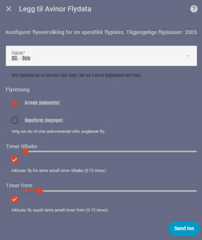

# Avinor Flight Data

Custom Home Assistant integration that keeps your dashboards up to date with arrivals and departures from the official Avinor data feed.

**Data source:** Flydata fra Avinor – https://partner.avinor.no/tjenester/flydata/

## Table of Contents
- [Overview](#overview)
- [Repository Structure](#repository-structure)
- [Features](#features)
- [Installation](#installation)
- [Configuration](#configuration)
- [Companion Lovelace Card](#companion-lovelace-card)
- [Example Dashboard Card](#example-dashboard-card)
- [Troubleshooting](#troubleshooting)
- [Release Notes](#release-notes)
- [Attribution](#attribution)

## Overview

- Polls Avinor's API on a recommended three-minute cadence and exposes the results as Home Assistant sensors.
- Includes Norwegian and English translations so the integration fits natively into your UI.
- Ships with tests that validate API parsing, helping future contributors keep behaviour stable.

## Repository Structure

- `custom_components/avinor_flight_data/` – Home Assistant integration package.
- `docs/assets/example_afd.png` – Example Lovelace card screenshot used in documentation.
- `tests/` – Unit tests covering the API parsing logic.

## Features

**Integration**
- Select from 300+ airports using a searchable dropdown.
- Choose arrivals or departures per sensor instance and control the time window (default: -1/+7 hours).
- Automatic refresh every three minutes, aligned with Avinor guidance.

**Lovelace Card (separate repository)**
- Responsive table layout that hides irrelevant columns for arrivals.
- Converts UTC timestamps to local time for readability.
- Translates status codes and airport identifiers into human-friendly labels.

## Installation

1. In Home Assistant, open HACS → Integrations → ⋮ → Custom repositories.
2. Add `https://github.com/WickedGhost/avinor_flight_data` as type `Integration`.
3. Install **Avinor Flight Data** from HACS.
4. Restart Home Assistant.
5. Navigate to Settings → Devices & Services → Add Integration → search for "Avinor Flight Data".
6. Follow the configuration flow to pick an airport, direction, and time window.

## Configuration

| Option       | Description                                           | Default |
|--------------|-------------------------------------------------------|---------|
| Airport      | Any Avinor airport (searchable list).                 | none    |
| Direction    | `A` (arrivals) or `D` (departures).                   | `D`     |
| Time from    | Hours back from now to include in results.            | `1`     |
| Time to      | Hours forward from now to include in results.         | `7`     |

Each configured sensor reports the flight count as its state and exposes detailed flight data through the `flights` attribute.

## Companion Lovelace Card

Repository: https://github.com/WickedGhost/avinor-flight-card

**Install via HACS (Frontend)**
- HACS → Frontend → ⋮ → Custom repositories → add the card repository as `Lovelace`.
- Install **Avinor Flight Card** and restart if prompted.
- Ensure the resource `/hacsfiles/avinor-flight-card/avinor-flight-card.js` is listed under Settings → Dashboards → Resources.
- Edit your dashboard and add the "Avinor Flight Card" from the picker.

**Manual YAML alternative**

```yaml
type: custom:avinor-flight-card
entity: sensor.avinor_osl_d
title: Oslo Departures
```

## Example Dashboard Card



```yaml
type: custom:avinor-flight-card
entity: sensor.avinor_OSL_A
title: Ankomster OSL
```

## Troubleshooting

- Card missing from the picker: clear browser cache or add the card resource manually.
- Integration not listed: verify HACS installed it and restart Home Assistant.
- Empty sensor state: check the entity in Developer Tools → States and confirm the selected window includes flights.
- Resource 404 errors: confirm the path `/hacsfiles/avinor-flight-card/avinor-flight-card.js` exists after installation.

## Release Notes

- **0.2.1**
  - Split the Lovelace card into its own repository.
  - Updated HACS/Hassfest workflows to meet current validation requirements.
  - Refreshed documentation for the new repository layout.
- **0.2.0**
  - Ensured Python 3.10 compatibility during integration setup.
  - Hardened API error handling for timeouts, HTTP failures, and connection issues.
  - Cached the airport list for 24 hours to limit external requests during setup.
  - Respected options overrides (time window) after reload.
  - Escaped HTML in the Lovelace card and added initial API parsing tests.

## Attribution

"Flydata fra Avinor" – https://www.avinor.no/
